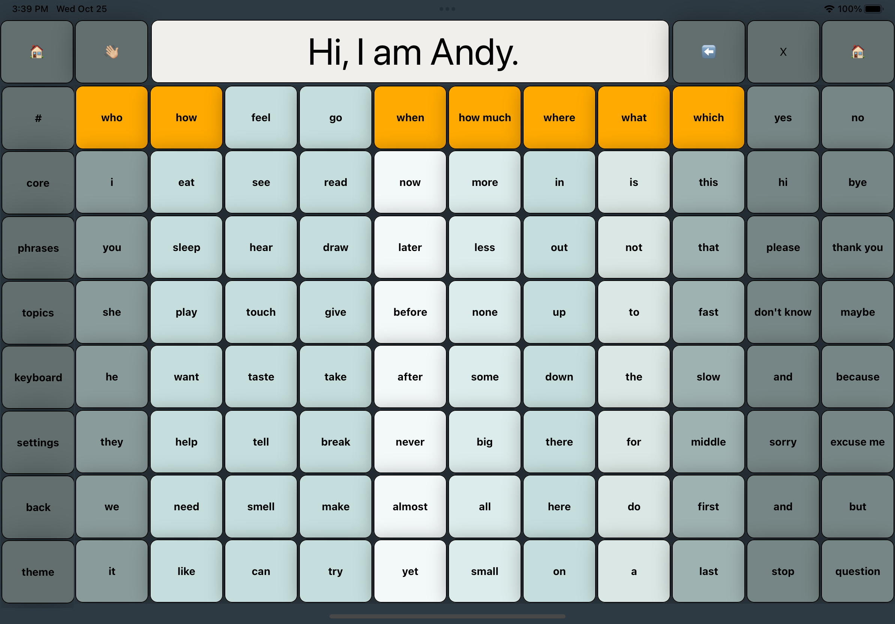
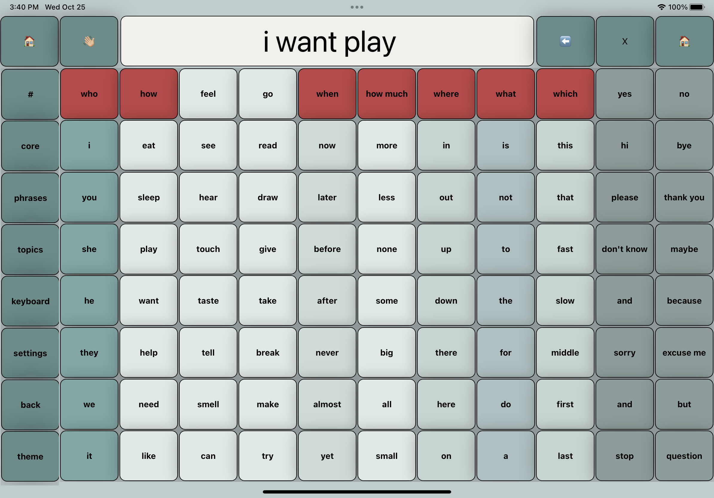
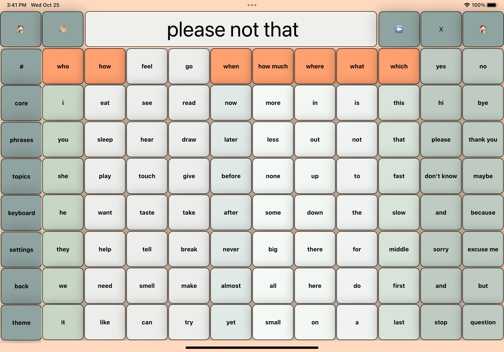
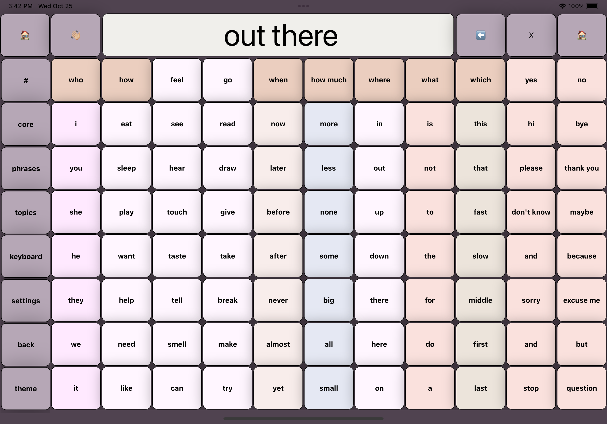

# unMute-app

A talking soundboard for speech-impaired kids (React Native)

## Summary

Unmute is a mobile application designed to empower speech-impaired children with a voice of their own. Built using React Native, this full-stack application targets an initial market of 5-year-old children in Taiwan. The app functions as a talking soundboard, making it easier for children to communicate their thoughts, wants, and needs; allowing them to develop their own sense of self and autonomy.

The application has a broader roadmap that includes extending its features for a wider age range and adaptation for medical conditions like aphasia or stroke. In addition to the app, we will later be offering AAC (Augmentative and Alternative Communication) training videos, programs, and workshops to onboard therapists and parents effectively.

The journey of developing this app has been an incredible learning experience, from understanding the unique challenges faced by speech-impaired children to engineering a responsive, user-friendly interface. We're not just building an app; we're creating a tool that can change lives.

## Author

**Andy Wang** - _React Native Developer_ - [LinkedIn](https://www.linkedin.com/in/andy-wang-wreckcreation)
